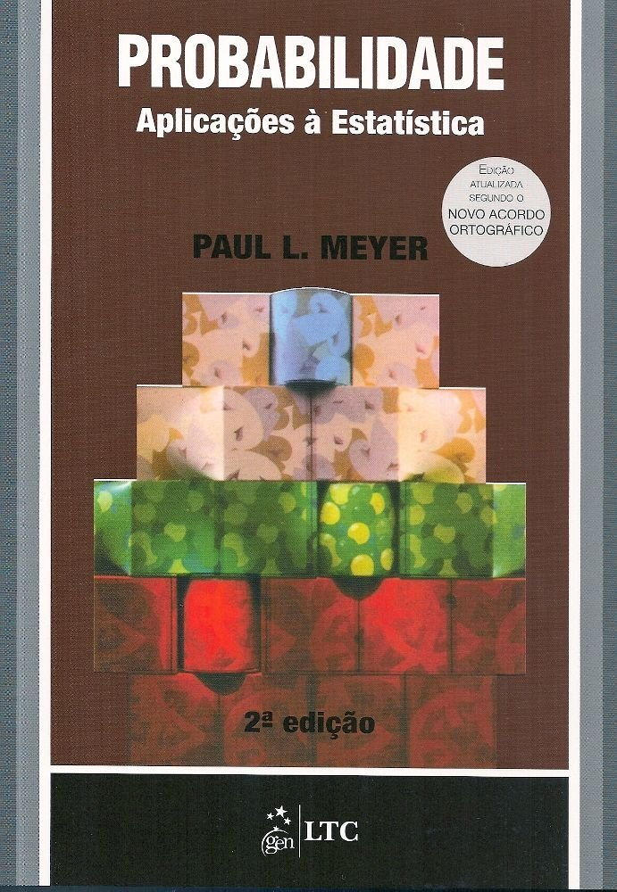
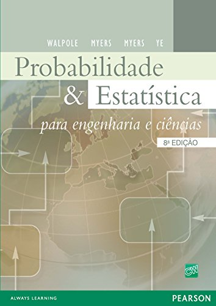
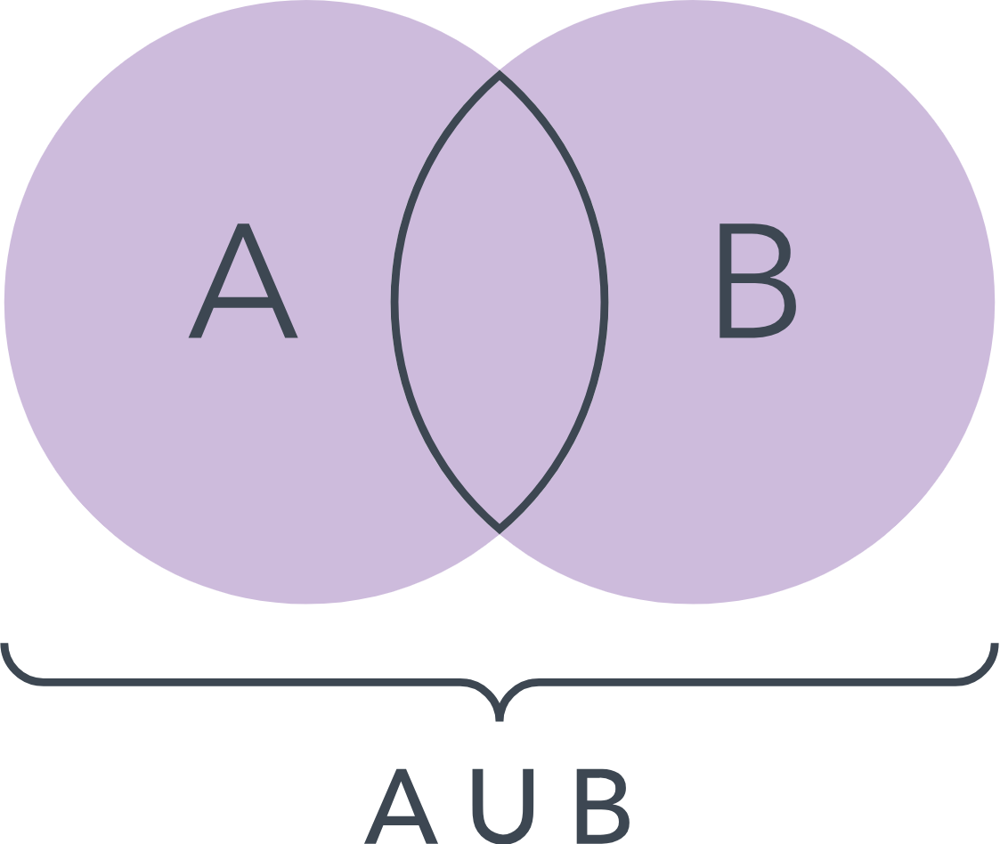
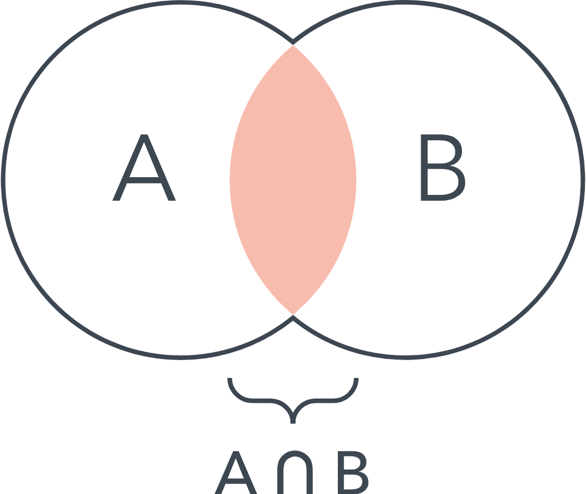
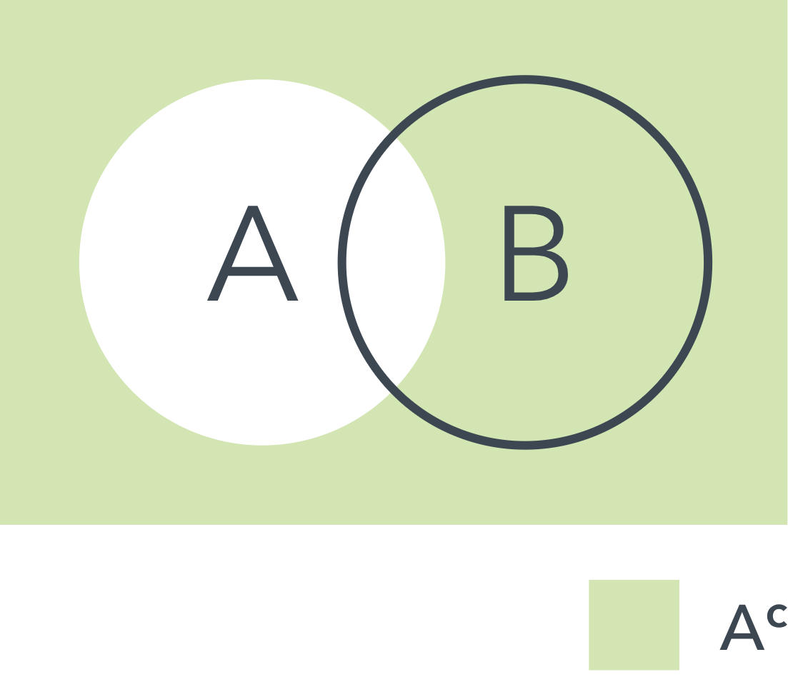

## Canais de Comunicação e Materiais da Disciplina

- Site: <http://sadraquelucena.github.io/prob1>

- Grupo no WhatsApp: <http://tiny.cc/prob1wpp>

{fig-align="center"}

## Informações da disciplina

- **Componente curricular:** ESTAT0072 -- Probabilidade I
- **Vagas Reservadas:** Estatística
- **Carga horária:** 60 horas (4 créditos)
- **Horário:**
  - Terças -- 20h45 às 22h15
  - Quintas -- 19h00 às 20h30
- **Docente:** Prof. Dr. Sadraque E. F. Lucena

## Objetivos

- Capacitar o aluno na utilização e compreensão da teoria probabilística.
- Identificar e reconhecer os problemas que necessitam da utilização de

    - distribuições de probabilidade;
    - distribuições condicionadas;
    - variáveis aleatórias e funções de variáveis aleatórias.

## Ementa

- Revisão básica de teoria dos conjuntos
- Técnicas de contagem
- Modelo probabilístico para um experimento aleatório
- Espaços de probabilidade
- Axiomas de Kolmogorov
- Probabilidade condicional e independência
- Função de distribuição de variáveis aleatórias discretas.

## Conteúdo programático

1. Modelo Probabilístico para um experimento aleatório

    1.1. Experimento Aleatório
    
    1.2. Espaço Amostral
    
    1.3. Evento

2.  Revisão básica de teoria de conjuntos

    2.1. Conjuntos, elementos
    
    2.2. Operações entre conjuntos

3. Técnicas de Contagem

    3.1. Permutação ou Arranjo simples e com repetição
    
    3.2. Permutação Circular
    
    3.3. Combinação simples e com repetição

## Conteúdo programático

4. Definições e espaços de Probabilidade

    4.1. Classes de Conjuntos: sigma-álgebra
    
    4.2. Definições de Probabilidade
    
    4.3. Definição frequentista
    
    4.4. Definição Geométrica
    
    4.5. Definição Clássica
    
    4.6. Axiomas de Kolmogorov

## Conteúdo programático

5. Probabilidade Condicional e Independência

    5.1. Probabilidade condicional
    
    5.2. Regra do Produto de Probabilidades
    
    5.3. Lei da Probabilidade Total
    
    5.4. Diagrama de árvore
    
    5.5. Partição do espaço amostral
    
    5.6. Teorema de Bayes
    
    5.7. Independência de dois eventos
    
    5.8. Independência de vários eventos

## Conteúdo programático

6. Variável aleatória discreta

    6.1. Função de distribuição de variáveis aleatórias discretas
    
    6.2. Variável Aleatória Discreta
    
    6.3. Função de Probabilidade e suas propriedades
    
    6.4. Função de Distribuição ou Função Acumulada de probabilidade
    
    6.5. Esperança e Variância de uma V.A.D.
    
    6.6. Variável Aleatória Discreta: Bidimensional

## Bibliografia Recomendada

::: {.columns}
::: {.column width="33%"}

:::
::: {.column width="33%"}

:::
::: {.column width="33%"}

:::
:::

## Metodologia

- 2 encontros semanais, com 90 minutos de aula presencial cada
- 30 minutos de atividades extraclasse (hora-trabalho) para cada aula, indicadas pelo docente

## Datas Importantes

### Avaliações

- **Avaliação 1:** 05/05/2026 (terça)
- **Avaliação 2:** 09/06/2026 (terça)
- **Avaliação 3:** 21/07/2026 (terça)
- **Avaliação Repositiva:** 23/07/2026 (quinta)

### Não haverá aula

- **21/04/2026:** Tiradentes (feriado nacional)
- **04/06/2026:** Corpus Christi (recesso acadêmico)
- **23/06/2026:** Véspera de Sâo João (recesso acadêmico)

# Conceitos Iniciais

## A Arquitetura da Incerteza

- **O paradigma da matemática: $y = f(x)$** 
  - Você busca a resposta exata. 
  - Exemplo: $y= 2x$. Se $x=2$, $y=4$.
  - É o mundo do "com certeza".
- **O mundo real não é assim:**
  - Não vem com funções prontas, há sempre ruído.
  - Se você investe na bolsa, não há uma fórmula que garanta o lucro.
  - Se você toma um remédio, não há 100% de certeza da cura.

---

## A Arquitetura da Incerteza

- Se não há certeza do resultado, como tomar uma decisão?
  - Através da **Probabilidade**.

- **Papel do Estatístico e do Cientista de Dados:**
  - Modelar a incerteza.
  - Ao invés de buscar o resultado certo, calcular o resultado "provável".
  - No mercado de trabalho e na pesquisa de ponta, as grandes decisões não são tomadas por quem sabe resolver uma conta, mas por quem sabe medir o risco e prever o futuro no meio do caos.

---

## Probabilidade no Dia-a-dia

- A probabilidade deixou de ser apenas teoria para se tornar o "combustível" da tecnologia.
  - **Algoritmos de Recomendação:** Por que o TikTok "vicia"?
    - Por que ele roda milhões de cálculos por segundo para calcular a probabilidade de você ter interesse em um vídeo, dado tudo o que você já assistiu.
  - **Finanças e Risco:** Por que o banco bloqueia um cartão por suspeita de fraude?
    - Um modelo probabilístico detectou que o gasto é um **evento raro**, de baixíssima probabilidade, a partir da modelagem do seu comportamento de gastos.

---

## Definição 1.1: Experimento Aleatório

- Um *experimento aleatório* é um processo que, mesmo repetido sob condições idênticas, produz resultados imprevisíveis.
- Características:
  1. *Repetibilidade:* Pode ser realizado infinitamente sob as mesmas condições.
  2. *Variabilidade:* O resultado individual é incerto (não há determinismo).
  3. *Regularidade Estatística:* Em longo prazo, os resultados seguem um padrão (frequência).
- **Exemplos:** Lançar um dado, tempo de resposta de um servidor, oscilação de uma ação na bolsa.

---

## Definição 1.1: Experimento Aleatório

- Embora o resultado individual seja imprevisível, a proporção de vezes que um resultado ocorre em muitas repetições tende a se estabilizar. É essa estabilidade que permite a **modelagem estatística**.

---

## Definição 1.2: Espaço Amostral ($\Omega$)

- Conjunto de todos os resultados possíveis de um experimento aleatório.
- Propriedades:
  1. Não pode faltar nenhum resultado.
  2. Os resultados não podem se sobrepor (se um ocorre, o outro não).
- **Notação:**
  - $\Omega = \{ \omega_1, \omega_2, \dots, \omega_n \}$ (Discreto)
  - $\Omega = \{ x \in \mathbb{R} \mid a \le x \le b \}$ (Contínuo)

---

## Classificação do Espaço Amostral ($\Omega$)

- **Finito:** O número de resultados é limitado e pode ser contado até o fim.
  - *Exemplo:* Resultados de um dado $\{1, 2, 3, 4, 5, 6\}$.
- **Infinito Enumerável:** Os resultados nunca acabam, mas podem ser "listados" na ordem $(1º, 2º, 3º...)$. Existe uma correspondência biunívoca com os Números Naturais ($\mathbb{N}$).
  - *Exemplo:* Número de tentativas até a primeira falha de um sistema.
- **Infinito Não-Enumerável (Contínuo):** Os resultados são tantos que é impossível listar. Representado por intervalos reais.
  - *Exemplo:* Tempo de espera, altura, pressão arterial.

---

## Observação sobre Espaço Amostral

- O espaço amsotral de um fenômeno não é único, mas depende do que você está observando.
- **Exemplo:** Se lançamos dois dados, nosso $\Omega$ pode ser
  - o conjunto de pares ordenados $\{(1,1), (1,2), \dots, (6,6)\}$ (36 elementos)
  - ou apenas a soma dos valores $\{2, 3, \dots, 12\}$.

---

## Definição 1.2: Conjunto Fundamental

- Definimos o **conjunto fundamental** ou **universo** de todos os objetos que estejam sendo estudados.
- Este conjunto é, em geral, representado pela letra $U$.

---

## Definição 1.3: Conjunto Vazio

- Definimos o **conjunto vazio** ou **nulo** como o conjunto que não contenha qualquer elemento. 
- **Exemplo:** o conjunto dos números reais $x$ que satisfaçam à equação $x^2+1=0$.
- Geralmente se representa o conjunto vazio por $\emptyset$.

---

## Definição 1.4: Subconjunto
			
- Um conjunto $A$ é **subconjunto** de $B$ se o conjunto $A$ implica no conjunto $B$.
- **Representação:** $A\subset B$.
- Dizemos que $A \subset B$ se todo elemento de $A$ também é elemento de B ($x \in A \implies x \in B$). Na linguagem de dados, se o evento $A$ ocorre, o evento $B$ ocorre necessariamente.
- **Observação:** Dois conjuntos $A$ e $B$ são iguais se, e somente se, eles contiverem os mesmos elementos.

    - $A=B \Leftrightarrow A\subset B$ e $B\subset A$.

---

## Propriedades Imediatas

- Para todo conjunto $A$, temos que $\emptyset\subset A$.
- Desde que se tenha definido o conjunto fundamental, então, para todo conjunto $A$, considerado composição de $U$, teremos $A\subset U$.

### Exemplo
Suponha que $U=$ todos os números reais, $A=\{x|x^2+2x-3=0\}$, $B=\{x|(x-2)(x^2+2x-3)=0\}$ e $C=\{x|x=-3,1,2\}$.

- Então, $A\subset C$ e $B=C$.

---

##

- Veremos agora operações sobre conjuntos.

---

## Definição 1.5: União

- Sejam $A$ e $B$ dois conjuntos.
- Definimos $C$ como a **união** de $A$ e $B$ (algumas vezes denominada soma de $A$ e $B$) da seguinte maneira:
$$
  C = \{x\, |\, x\in A \text{ ou } x\in B \text{ (ou ambos)}\}.
$$
- Portanto, $C$ será formado de todos os elementos que estejam em $A$, ou em $B$, ou em ambos.
- Notação: $C=A\cup B$.

---

## Definição 1.6: Interseção

- Sejam $A$ e $B$ dois conjuntos.
- Definimos $D$ como a **interseção** de $A$ e $B$ (algumas vezes denominada produto de $A$ e $B$) da seguinte maneira:
$$
  D = \{x|x\in A \text{ e } x\in B\}.
$$
- Assim, $D$ será formado pelos elementos que estão em $A$ e em $B$.
- Notação: $D=A\cap B$.

---

## Definição 1.7: Complementar

- O **complementar** de um conjunto $A$ é constituído por todos os elementos que não estejam em $A$, mas estejam no conjunto fundamental $U$, isto é,
$$
  A^{\mathsf{c}} = \{x|x\notin A\}.
$$
- Notação: $A^{\mathsf{c}}$.
- Pode-se utilizar a notação $\overline{A}$ para definir o complementar de $A$.

---

##

- Uma forma de visualizarmos operações sobre conjuntos é por meio do **Diagrama de Venn**:

 

::: {.columns}
::: {.column width="33%"}

:::
::: {.column width="33%"}

:::
::: {.column width="33%"}

:::
:::

---

##

- As operações de união e interseção podem ser estendidas, intuitivamente, para qualquer número finito de conjuntos.
- Definimos $A\cup B\cup C$ como $A\cup (B\cup C)$ ou $(A\cup B)\cup C$.
- Analogamente, definimos $A\cap B\cap C$ como $A\cap (B\cap C)$ ou $(A\cap B)\cap C$.
- Podemos continuar essas composições para qualquer número finito de conjuntos.

---

## Exemplo 1.1

Suponha que $U=\{1,2,3,4,5,6,7,8,9,10\}$, $A=\{1,2,3,4\}$ e $B=\{3,4,5,6\}$. Determine

a. $A^{\mathsf{c}}$

b. $A\cup B$

c. $A\cap B$

---

## 

### Leis Comutativas

a. $A\cup B = B\cup A$

b. $A\cup (B \cup C) = (A\cup B) \cup C$

### Leis Associativas

c. $A\cap B = B\cap A$

d. $A\cap (B \cap C) = (A\cap B) \cap C$

---

##

### Outras identidades de Conjuntos

e. $A\cup (B\cap C) = (A\cup B) \cap (A\cup C)$

f. $A\cap (B\cup C) = (A\cap B) \cup (A\cap C)$

g. $A\cap \emptyset = \emptyset$

h. $A\cup \emptyset = A$

i. **$(A\cap B)^{\mathsf{c}} = A^{\mathsf{c}} \cup B^{\mathsf{c}}$** (Lei de Morgan)

j. **$(A\cup B)^{\mathsf{c}} = A^{\mathsf{c}} \cap B^{\mathsf{c}}$** (Lei de Morgan)

k. $(A^{\mathsf{c}})^{\mathsf{c}} = A$

- g e h mostram que $\emptyset$ se comporta entre os conjuntos (relativamente às operações $\cup$ e $\cap$) da maneira que o zero (com relação às operações de adição e multiplicação) o faz entre os números.

---

## Produto Cartesiano
			
- Sejam $A$ e $B$ dois conjuntos.

- O **produto cartesiano** de $A$ e $B$, denotado por $A\times B$, é o conjunto de todos os pares ordenados nos quais o primeiro elemento é tirado e $A$ e o segundo, de $B$. Ou seja,
$$
  A\times B = \{(a,b), a\in A, b\in B\}.
$$

### Exemplo
Suponha que $A=\{1,2,3\}$ e $B=\{1,2,3,4\}$. Então,
$$
  A\times B = \{(1,1),(1,2),\ldots,(1,4),(2,1),\ldots,(2,4),(3,1),\ldots,(3,4)\}.
$$

---

## 

- Em geral, $A\times B\neq B\times A$.
- A notação pode ser estendida da seguinte maneira:

    - Se $A_1,A_2,\ldots,A_n$ forem conjuntos, então, $$A_1\times A_2\times \cdots\times A_n = \{(a_1, a_2,\ldots,a_n), a_i\in A_i, i=1,\ldots,n\}.$$
    - Ou seja, o conjunto de todas as ênuplas ordenadas.

---

##

- Se existir um número finito de elementos no conjunto $A$, digamos $a_1, a_2,\ldots,a_n$, diremos que $A$ é **finito**.
- Se existir um número infinito de elementos em $A$ que possam ser postos em correspondência biunívoca com os inteiros positivos, diremos que $A$ é **numerável** ou **infinito enumerável**.
- Se os elementos do conjunto $A$ não puderem ser enumerados, ele é dito **infinito não numerável**.

---

##

### Exemplo 1.3
Suponha que o conjunto fundamental seja formado pelos inteiros positivos de 1 a 10. Sejam	$A = \{2, 3, 4\}$, $B = \{3, 4, 5\}$ e $C = \{5, 6, 7\}$. Enumere os elementos do conjunto $A \cap (B\cup C)^c$.

### Exemplo 1.4
Suponha que o conjunto fundamental $U$ seja formado por $U = \{x ~|~ 0 \leq x \leq 2\}$. Sejam os conjuntos $A$ e $B$ definidos da forma seguinte: $A = \{x ~|~ 1/2 < x \leq 1\}$ e $B = \{x ~| ~1/4 \leq x < 3/2\}$. Descreva o conjunto $(A\cup B)^c$.

---

## 

### Exemplo 1.5
A relação $(A \cup B) \cap (A \cup C) = A \cup (B \cap C)$ é verdadeira?

### Exemplo 1.6
Suponha que o conjunto fundamental seja formado por todos os pontos $(x, y)$ de coordenadas ambas inteiras, e que estejam dentro ou sobre a fronteira do quadrado limitado pelas retas $x = 0$, $y = 0$, $x = 6$ e $y = 6$. Enumere os elementos do conjunto $A = \{(x, y) ~|~ x^2 + y^2 \leq 6\}$.

### Exemplo 1.7
Empregue o diagrama de Venn para estabelecer a relação $A \subset B$ e $B \subset C$ implica que $A \subset C$.

# Fim