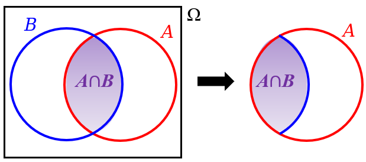

## Exemplo 5.1

Você lança um dado comum de 6 faces e observa o número que aparece na face voltada para cima.

Considere estes dois eventos:

- $A$: "A face voltada para cima é um número par"
- $B$: "A face voltada para cima é um número maior que 4"

Qual é a probabilidade de que a face voltada para cima seja maior que 4, dado que sabemos que ela é um número par?

---

## Definição 5.1: Probabilidade Condicional

- A probabilidade de que um evento $B$ ocorra, dado que o evento $A$ já ocorreu, é definida como:
$$
  P(B|A) = \frac{P(A\cap B)}{P(A)},
$$
desde que $P(A) > 0$. 

- $P(B|A)$ se lê como *probabilidade de $B$ dado $A$*.

---

## 

#### O que estamos buscando ao calcular $P(B|A)$?

- Estamos tentando descobrir a probabilidade de estar em $B$, sabendo que já estamos em $A$.

#### Reduzindo o Espaço Amostral

- Tradicionalmente, ao calcular probabilidades, consideramos todos os resultados possíveis no espaço amostral ($\Omega$).

- No entanto, com a probabilidade condicional, a informação de que o evento $A$ já ocorreu **muda nosso universo de possibilidades**.

- Agora, nosso novo "espaço amostral" se torna o próprio evento $A$. Não olhamos mais para $\Omega$ inteiro, mas apenas para os resultados que estão **dentro de $A$**.

---

## 

  
Fonte: http://clubes.obmep.org.br/blog/sala-de-estudo-probabilidades-sala-3/

---

## $P(B | A)$ é uma Probabilidade

- $P(B | A)$ também é uma medida de probabilidade que respeita todos os axiomas de Kolmogorov:

  1. $P(S | A) = 1$
  2. $P(B | A) \geq 0$
  3. Se $B_1$ e $B_2$ são mutuamente excudentes, $P(B_1 \cup B_2 | A) = P(B_1 | A) + P(B_2 | A)$.

- Todas as regras que aprendemos na aula anterior (complementar, união, etc.) continuam valendo para probabilidade condicional.

---

##

Temos duas maneiras principais de calcular a probabilidade condicional $P(B∣A)$:

1. **Abordagem Direta (Espaço Amostral Reduzido):**

    - Consideramos diretamente a probabilidade de $B$ dentro do novo e menor espaço amostral, que é o evento $A$.
    
    - Pense: "Dos casos em que $A$ acontece, quantos deles também fazem $B$ acontecer?"

2. **Abordagem pela Definição (Fórmula):**

    - Para usar essa abordagem, precisamos conhecer (ou conseguir calcular) a probabilidade da interseção de $A$ e $B$, $P(A\cap B)$, e a probabilidade de $A$, $P(A)$.

---

## Exemplo 5.2

Em uma pesquisa de opinião realizada com 800 indivíduos sobre a aceitação de uma nova política pública, os resultados foram tabulados por gênero da seguinte forma:

| Categoria | Mulheres | Homens | Total |
|-----------|---------------|--------------|-------|
| Aprovam  | 250 | 190 | 440 |
| Desaprovam  | 120 | 240 | 360 |
| **Total** | **370** | **430** | **800** |

Se uma pessoa é selecionada aleatoriamente dessa pesquisa e sabemos que ela aprovou a nova política pública, qual é a probabilidade de que essa pessoa seja um homem?

---

## Exemplo 5.3

Em um estudo de mercado recente sobre os hábitos de consumo de conteúdo digital, observou-se que 40% dos participantes assinam serviços de streaming de filmes. Além disso, o estudo revelou que 25% dos participantes assinam serviços de streaming de filmes e também são consumidores frequentes de documentários. Se um participante é selecionado aleatoriamente e sabemos que ele assina serviços de streaming de filmes, qual é a probabilidade de que ele também seja um consumidor frequente de documentários?

---

## Exemplo 5.4

Em uma pesquisa recente com estudantes universitários, foram levantados dados sobre o consumo de plataformas de streaming. Os resultados mostraram que 70% dos estudantes utilizam uma plataforma de streaming de vídeo, enquanto 50% utilizam uma plataforma de streaming de música. Além disso, verificou-se que 85% dos estudantes utilizam pelo menos uma dessas duas plataformas (seja de vídeo ou de música). Com base nessas informações, se um estudante é selecionado aleatoriamente e sabemos que ele utiliza uma plataforma de streaming de vídeo, qual é a probabilidade de que ele também utilize uma plataforma de streaming de música?

---

##

Agora vamos mudar um pouco...

 

### Exemplo 5.5
Um lote contém 20 peças defeituosas e 80 não-defeituosas. Qual a probabilidade de escolhermos duas peças defeituosas:

a. com reposição?

b. sem reposição?

---

## Regra da Multiplicação

- Uma das consequências mais importantes da definição de probabilidade condicional é que podemos rearranjá-la:
$$
  P(B|A) = \frac{P(A\cap B)}{P(A)} \Rightarrow P(A\cap B) = P(A)P(B|A).
$$

- Este resultado é conhecido como Regra da Multiplicação ou Teorema da Multiplicação para eventos quaisquer.

- **Lembre-se:** Use esta regra quando o evento $B$ é **influenciado ou depende da ocorrência do evento $A$**.

    - No exemplo das peças, a probabilidade da segunda peça ser defeituosa depende se a primeira foi reposta ou não!

---

## Exemplo 5.6

Em uma sala com 15 pessoas, há 6 homens e 9 mulheres. Duas pessoas são escolhidas aleatoriamente, uma após a outra, para receber um brinde. Qual é a probabilidade de que as duas sejam mulheres?

---

## Regra da Multiplicação

- A regra da multiplicação pode ser generalizada para mais de dois eventos da seguinte maneira:
$$
  \begin{aligned}
			&P(A_1\cap A_2\cap A_3\cap\cdots\cap A_n) =\\ &P(A_1)P(A_2|A_1)P(A_3|A_1\cap A_2)\cdots P(A_n|A_1\cap\cdots\cap A_{n-1}).
		\end{aligned}
$$

---

## Exemplo 5.7

Três cartas são escolhidas em sucessão, **sem reposição**, de um baralho comum de 52 cartas. Determine a probabilidade do evento $A_1 \cap A_2 \cap A_3$, onde:

* $A_1$: a primeira carta escolhida é um **ás vermelho**.
* $A_2$: a segunda carta escolhida é um **ás ou um valete**.
* $A_3$: a terceira carta escolhida é **maior que 3, mas menor que 7** (ou seja, 4, 5 ou 6).

---

## Resumo

| Conceito | Intuição | Fórmula |
|:--- |:--- |:---:|
| **Probabilidade Condicional** | Probabilidade de $B$ ocorrer sabendo que $A$ **já aconteceu**. | $P(B|A) = \frac{P(A \cap B)}{P(A)}$ |
| **Regra da Multiplicação** | Probabilidade da **interseção** (ocorrência sucessiva de eventos). | $P(A \cap B) = P(A) \cdot P(B|A)$ |

# Fim