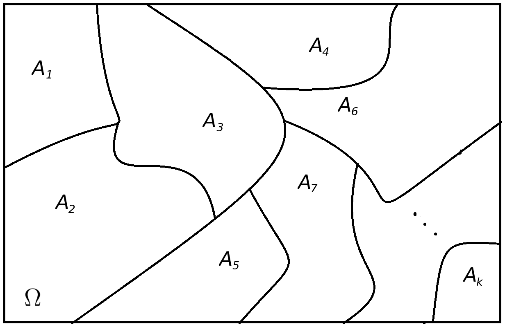
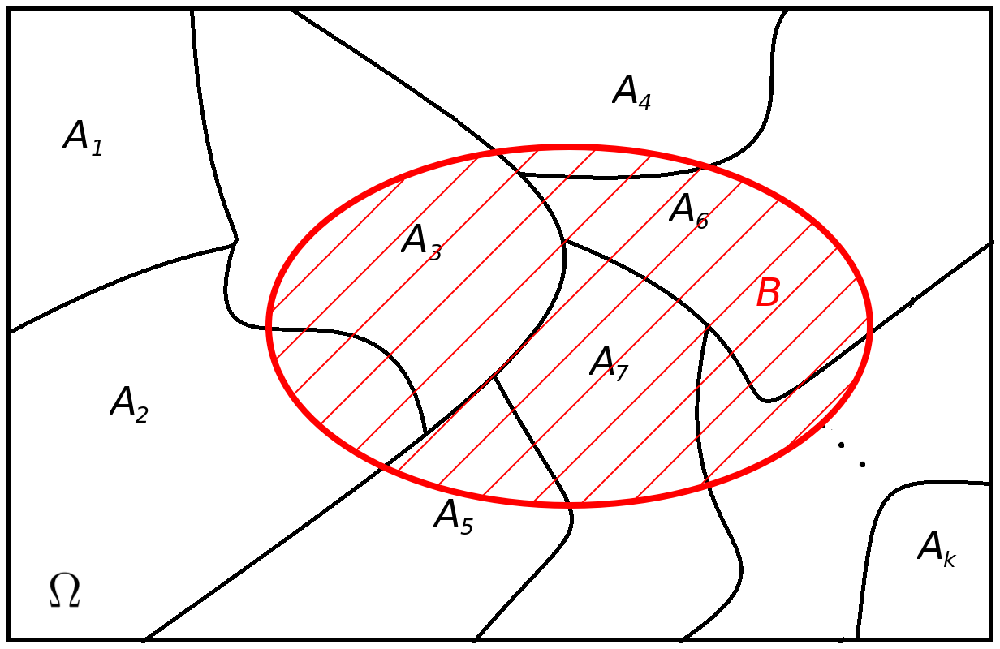

## 

- Até aqui empregamos o conceito de probabilidade condicional a fim de avaliarmos a probabilidade de ocorrência conjunta de dois ou mais eventos.

- Poderemos aplicar esse conceito em outra maneira de calcular a probabilidade de um evento simples $B$.

---

## Definição 6.1: Partição do espaço amostral

Dizemos que os eventos $A_1, A_2, \ldots, A_k$ representam uma partição do espaço amostral quando

a) $A_i \cap A_j = \emptyset, \forall \, i\neq j$

b) $\bigcup\limits_{i=1}^k A_i = \Omega$

  

---

## Teorema da Probabilidade Total

- Considere um evento $B\subset \Omega$.
- Podemos dizer que $B$ é formado pela união das partes de $B$ que fazem interseção com os $A_i$, $i=1,\ldots,k$, ou seja,
$$
  B = (B\cap A_1)\cup(B\cap A_2)\cup\cdots\cup(B\cap A_k)
$$

  

- Note que algumas desas interseções podem ser vazias.

---

## Teorema da Probabilidade Total

Assim,

$$
  \begin{aligned}
		P(B) &= P(B\cap A_1)+P(B\cap A_2)+\cdots+P(B\cap A_k)\\
		     &\!\!\!= P(A_1)P(B|A_1)+P(A_2)P(B|A_2)+\cdots+P(A_k)P(B|A_k)\\
			   &\!\!\!= \sum_{i=1}^{k} P(A_i)P(B|A_i)
	\end{aligned}
$$

- Esse resultado é conhecido como **lei da probabilidade total** ou **teorema da probabilidade total**.
- Ele é útil quando não conseguimos calcular diretamente a probabilidade de $B$, e precisamos considerar todas as maneiras diferentes pelas quais $B$ pode ocorrer.

---

## Exemplo 6.1

Um aluno está resolvendo uma questão de um trabalho. A probabilidade de resolver a questão sem precisar de pesquisa é de 40%. Se ele optar por fazer a pesquisa, a probabilidade de resolver a questão é de 70%. A probabilidade de que o aluno decida fazer a pesquisa é de 80%. Calcule a probabilidade total de que o aluno consiga resolver a questão.

---

## Exemplo 6.2

Suponha que três máquinas ($M_1, M_2$ e $M_3$) operem simultaneamente. Considere que essas máquinas são responsáveis por 35%, 40% e 25% da produção total, respectivamente. Além disso, 2%, 3% e 1% das peças produzidas pelas máquinas $M_1$, $M_2$ e $M_3$, respectivamente, apresentam defeito. Ao final de um dia, uma peça é escolhida aleatoriamente da linha de produção. Qual é a probabilidade de que a peça escolhida esteja com defeito?

---

## Exemplo 6.3

Um banco utiliza um algoritmo de Inteligência Artificial para identificar transações fraudulentas. Dados históricos mostram que a probabilidade de uma transação ser Fraude ($F$) é de 1%. A probabilidade de ser uma Transação Legítima ($L$) é de 99%. O algoritmo nem sempre é perfeito: se a transação é Fraude, o algoritmo emite um Alerta ($A$) com 95% de precisão, $P(A|F) = 0,95$. Se a transação é Legítima, o algoritmo ainda pode emitir um Alerta ($A$) (falso positivo) com 2% de probabilidade, $P(A|L) = 0,02$. Qual é a probabilidade total de o algoritmo emitir um alerta para uma transação escolhida ao acaso?

---

## Exemplo 6.4

Suponha que quatro setores de uma biblioteca ($S_1$, $S_2$, $S_3$, e $S_4$) são responsáveis por arquivar diferentes categorias de livros. O setor $S_1$ é responsável por 40% dos livros, o setor $S_2$ por 25%, o setor $S_3$ por 20%, e o setor $S_4$ por 15%. Sabe-se que 3%, 6%, 4% e 2% dos livros arquivados nos setores $S_1$, $S_2$, $S_3$ e $S_4$, respectivamente, estão com informações incorretas na catalogação. Ao final de um dia, um livro é escolhido aleatoriamente do acervo. Qual é a probabilidade de que o livro escolhido esteja com informações incorretas?

---

## Exemplo 6.5

Um saco contém quatro bolas brancas e três pretas. Um segundo saco contém três bolas brancas e cinco pretas. Uma bola é retirada do primeiro saco e colocada no segundo. Qual é a probabilidade de que uma bola, selecionada em seguida do segundo saco, seja preta?

---

## Exemplo 6.6

Em uma fábrica, há dois compartimentos de peças. O primeiro compartimento contém 6 peças originais e 4 peças falsificadas. O segundo compartimento contém 5 peças originais e 7 peças falsificadas. Uma peça é retirada aleatoriamente do primeiro compartimento e transferida para o segundo compartimento. Em seguida, uma peça é retirada aleatoriamente do segundo compartimento. Qual é a probabilidade de que a peça retirada do segundo compartimento seja original?

# Fim