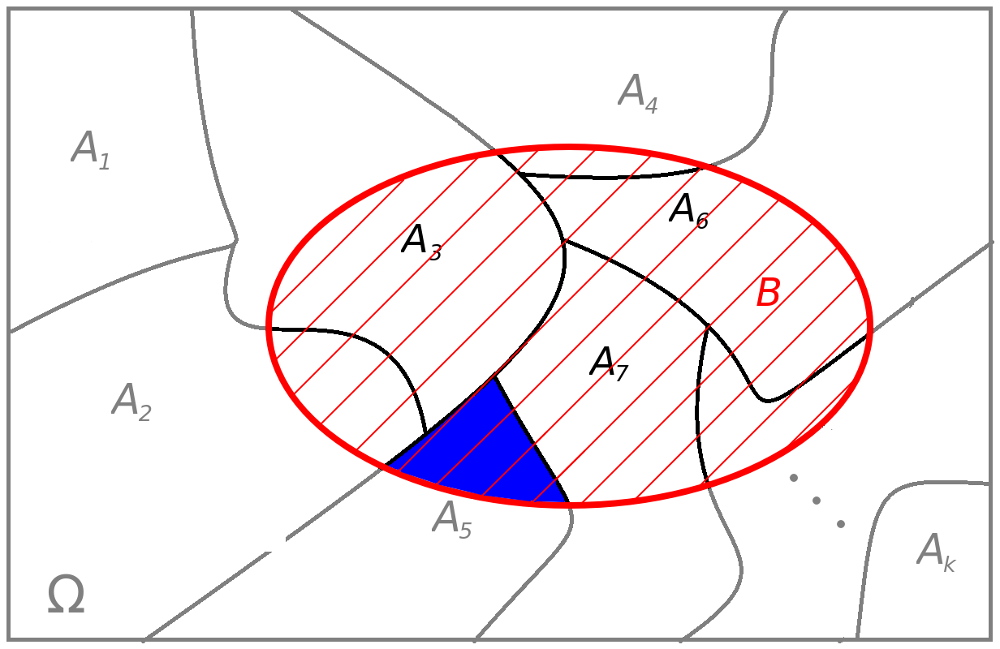

## Teorema de Bayes

- O Teorema de Bayes permite calcular a probabilidade de uma causa, dado que um efeito específico foi observado.
- Em outras palavras, ele ajuda a determinar a chance de um evento específico ter ocorrido antes do evento final que foi observado.
- Vejamos o teorema.

## Teorema de Bayes

A partir da Lei da Probabilidade Total de um evento $B$ numa partição $A_1,A_2,\ldots,A_k$ de $\Omega$, as probabilidades condicionais reversas $P(A_i|B)$ para $i=1,\ldots,k$, podem ser obtidas da seguinte forma:
$$
  P(A_i|B) = \frac{P(B|A_i)P(A_i)}{\sum\limits_{i=1}^k P(B|A_i)P(A_i)}, \quad i=1,\ldots,k.
$$

## Teorema de Bayes

  

## Exemplo 7.1

Suponha que três máquinas ($M_1, M_2$ e $M_3$) operem simultaneamente. Considere que essas máquinas são responsáveis por 35%, 40% e 25% da produção total, respectivamente. Além disso, 2%, 3% e 1% das peças produzidas pelas máquinas $M_1$, $M_2$ e $M_3$, respectivamente, apresentam defeito. Ao final de um dia, uma peça é escolhida aleatoriamente da linha de produção e verificado que ela apresenta defeito. Qual é a probabilidade de que a peça escolhida tenha sido fabricada pela máquina $M_2$?

## Exemplo 7.2

Um paciente recebeu o resultado de um exame de laboratório que detecta a doença com 98% de precisão quando a doença está presente, mas também fornece um "falso positivo" em 1% dos casos quando a doença não está presente. Sabendo que apenas 0,2% da população tem a doença e que o exame deu positivo, qual é a probabilidade de que o paciente tenha de fato a doença?

## Exemplo 7.3
Uma companhia de seguros classifica as pessoas em duas categorias: propensas ou não a acidentes. A estatística da companhia mostra que uma pessoa propensa a acidentes tem uma probabilidade de 0,4 de sofrer um acidente em um período de um ano, enquanto essa probabilidade é de 0,2 para uma pessoa não propensa a acidentes. Se 30% da população é classificada como propensa a acidentes,

a. qual é a probabilidade de que um novo segurado sofra um acidente no primeiro ano de vigência de sua apólice?

b. Suponha que um novo segurado sofra um acidente no primeiro ano de vigência de sua apólice. Qual é a probabilidade de que ele seja propenso a acidentes?

## Exemplo 7.4

Ao responder uma questão em uma prova de múltipla escolha, um estudante pode saber a resposta ou "chutar". Suponha que a probabilidade de que o estudante saiba a resposta seja 1/2, e que, se ele chutar, a chance de acertar seja 1/5. Se o estudante respondeu corretamente à questão, qual é a probabilidade de que ele realmente soubesse a resposta?

# Fim