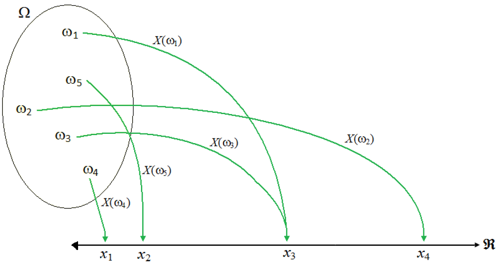

## Introdução

- Muitas vezes é mais interessante associarmos um número a um evento aleatório e calcularmos a probabilidade da ocorrência desse número do que a probabilidade do evento.
- A variável aleatória fornece um meio de descrever resultados experimentais usando-se valores numéricos.
- Exemplos:
  - Número de pessoas que visitam um determinado site, num certo período de tempo;
  - Volume de água perdido por dia, num sistema de abastecimento.

---

## Definição 9.1: Variável Aleatória

Sejam $E$ um experimento e $\Omega$ uma espaço amostral associado a esse experimento. Chamamos de **variável aleatória** (v.a.) uma função $X$ que associa cada elemento $\omega\in\Omega$ a um número real, $X(\omega)$.

- Note que, embora utilizamos o termo \textit{variável aleatória}, $X$ é uma função.

---

## Exemplo
Lançam-se 3 vezes uma moeda. A v.a. $X$ = "número de caras" associa ($C$: cara, $K$: coroa):

- $X(CCC) = 3$
- $X(KCK) = 1$
- $X(KKK) = 0$

 

- O contradomínio $R_X$ é o conjunto de todos os valores que a v.a. pode assumir.
  - No exemplo, $R_X = \{0,1,2,3\}$.

---

## Definição 9.2: Variável Aleatória Discreta

Uma v.a. $X$ é **discreta** se seu contradomínio $R_X$ é *finito* ou *infinito enumerável*.

- Uma v.a. discreta é geralmente associada a contagens.
- Exemplos:
  - Número de peças defeituosas em um lote (finito).
  - Número de carros que passam por um pedágio em uma hora (infinito enumerável).

---

## Definição 9.3: Função de Probabilidade (F.P.)

Para uma v.a. discreta $X$, a **função de probabilidade** $p(x)=P(X=x)$ nos dá a probabilidade de a v.a. assumir um valor específico $x$.

- Esta função deve satisfazer duas condições fundamentais:
  1. $p(x)\geq 0$, para todo $x$.
  2. $\sum\limits_{x\in R_X} p(x)=1$ (A soma de todas as probabilidades deve ser exatamente 1).

---

## Exemplo:

Seja a v.a. $X$ = "número de caras" em 3 moedas honestas.

- $P(X=0)=P(\{KKK\})=\frac{1}{8}$
- $P(X=1)=P(\{CKK, KCK, KKC\})=\frac{3}{8}$
- $P(X=2)=P(\{CCK, CKC, KCC\})=\frac{3}{8}$
- $P(X=3)=P(\{CCC\})=\frac{1}{8}$

 

- A soma das probabilidades é $\frac{1}{8}+\frac{3}{8}+\frac{3}{8}+\frac{1}{8}=1$.

---

## Visualização Gráfica

- As probabilidades dos valores da v.a. $X$ podem ser viualizadas por meio de gráficos de hastes.
- No exemplo anterior, temos:

- *Por que isso importa?* Ajuda a visualizar onde a "massa" da probabilidade está concentrada.

---

## Modelagem Matemática (Funções)

- Às vezes, $P(X=x)$ é dada por uma fórmula.
- Exemplo: $P(X=x) = \frac{x}{10}$ para $x \in \{1, 2, 3, 4\}$.
  - Verificação: $\frac{1}{10} + \frac{2}{10} + \frac{3}{10} + \frac{4}{10} = \frac{10}{10} = 1$. (Válida!)

---

## Exemplo 9.1

Um homem possui 4 chaves em seu bolso. Como está escuro, ele não consegue ver qual a chave correta para abrir a porta de sua casa. Ele testa cada uma das chaves até encontrar a correta.

(a) Defina um espaço amostral para esse experimento.
(b) Considere a v.a. $X$: *número de chaves experimentadas até conseguir abrir a porta (inclusive a chave correta)*. Determine os possíveis valores que $X$ pode assumir e suas respectivas probabilidades.

---

## Exemplo 9.2

Seja $X$ uma V.A. discreta com função de probabilidade dada por 
$$P(X=x) = k \cdot x, \quad \text{para } x \in \{1, 2, 3, 4, 5\}.$$

a) Determine o valor da constante $k$ para que esta seja uma função de probabilidade válida.
b) Calcule $P(X > 3)$.

---

## Exemplo 9.3

Um investidor comprou uma ação. Há 20% de chance de ele ganhar R$ 1.000, 50% de chance de ele empatar (R\$ 0) e 30% de chance de ele perder R$ 500. Seja $X$ o lucro do investidor. Represente $X$ graficamente.

---

## Exemplo 9.4

Um jogador paga R\$ 5,00 para participar num jogo onde lança um dado honesto de 6 faces. Se sair o número 6, ele ganha R\$ 20,00. Se sair o número 5, ele ganha R\$ 5,00 (recebe o que pagou de volta). Para qualquer outro resultado, ele não ganha nada. Seja $L$ a variável aleatória que representa o lucro líquido do jogador por partida.

a) Determine o suporte $R_L$ da variável aleatória.
b) Construa a tabela da função de probabilidade $P(L=l)$.
c) Qual a probabilidade de o jogador não ter prejuízo numa rodada?

---

## Exemplo 9.5

Um lote de 10 componentes eletrónicos contém 3 componentes defeituosos. Um técnico seleciona aleatoriamente 2 componentes para teste, sem reposição. Seja $X$ o número de componentes defeituosos encontrados na amostra.

a) Determine a função de probabilidade de $X$ (apresente os valores em forma de tabela).
b) Esboce o gráfico de hastes para esta distribuição.
c) Qual é a probabilidade de encontrar pelo menos um componente defeituoso?

# Fim