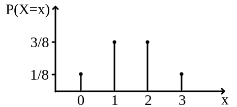
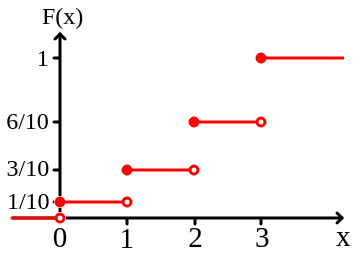

## Definição 10.1: Função de Distribuição Acumulada (FDA)

A Função de Distribuição Acumulada, denotada por $F(x)$, expressa a probabilidade de a variável aleatória $X$ assumir um valor menor ou igual a um número real $x$:
$$
F(x)=P(X≤x) = \sum\limits_{x_j\leq x} P(X=x_j).
$$

- **Intuição:** Enquanto a função de probabilidade (aula passada) foca em pontos isolados, a FDA foca no "passado" e no "presente" do valor $x$.

---

## Propriedades Fundamentais

- **Limites:** $\lim\limits_{x \to -\infty} F(x) = 0$ e $\lim\limits_{x \to \infty} F(x) = 1$.
- **Monotonicidade:** $F(x)$ é uma função não-decrescente (nunca diminui).
- **Continuidade à Direita:** Para variáveis discretas, a função dá um salto no ponto $x$, mas o valor do ponto pertence ao degrau de cima.
- **Cálculo de Intervalos:** $P(a < X \le b) = F(b) - F(a)$.

---

## Gráfico da Função de Distribuição Acumulada

- O gráfio da função de distribuição acumulada tem forma de escada. Cada degrau ocorre exatamente nos valores de $x$.
- O tamanho do salto no ponto $x$ é exatamente a probabilidade pontual $P(X=x)$.
- Exemplo:

:::: columns
::: {.column}

:::

::: {.column}

{align="right"}
:::
::::

---

## Exemplo 10.1

Dada a função de distribuição acumulada abaixo:
$$
F(x) = \begin{cases}
          0, & x < 1 \\
          0,\!3, & 1 \le x < 3 \\
          0,\!7, & 3 \le x < 4 \\
          1, & x \ge 4
          \end{cases}
$$

a) Determine o suporte da variável aleatória $X$.
b) Encontre a função de probabilidade $P(X=x)$ para cada valor do suporte.
c) Calcule $P(X \le 3)$ e $P(X > 3)$.

---

## Exemplo 10.2

Considere a V.A. $X$ com FDA dada por

- $F(0)=0,1$;
- $F(1)=0,4$;
- $F(2)=0,8$;
- $F(3)=1,0$.

Calcule:

a) $P(1 < X \le 3)$
b) $P(X \ge 2)$ usando a regra do complementar via FDA.
c) $P(0,\!5 < X < 2,\!5)$

---

## Exemplo 10.3

Uma moeda viciada tem probabilidade de cara igual a $0,6$. Lança-se esta moeda 2 vezes. Seja $X$ o número de caras obtido.

a) Determine a função de probabilidade de $X$.
b) Escreva a expressão analítica da FDA $F(x)$ (usando a notação de chaves por intervalos).
c) Esboce o gráfico da FDA.

---

## Exemplo 10.4

O número de falhas por hora em um servidor, $X$, possui a seguinte FDA:
$$F(x) = 1 - (0,5)^{x+1} \text{ para } x \in \{0, 1, 2, \dots\}$$

a) Calcule a probabilidade de ocorrerem no máximo 2 falhas em uma hora.
b) Calcule a probabilidade de ocorrerem exatamente 3 falhas. (Lembre-se: $P(X=x) = F(x) - F(x-1)$).

# Fim